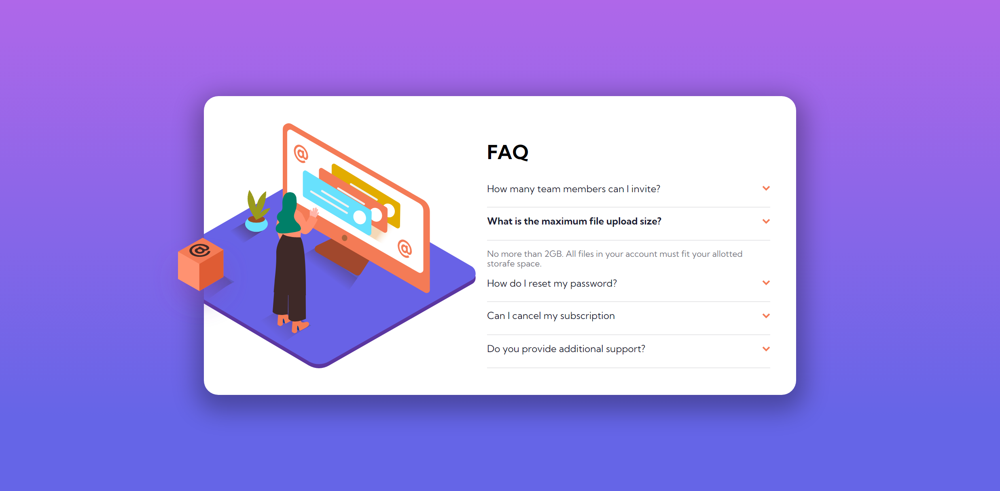
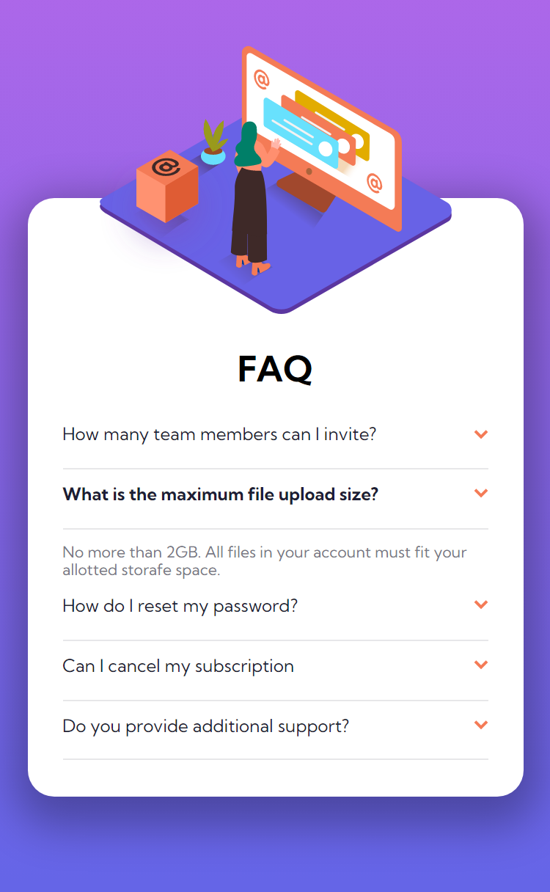

# Frontend Mentor - FAQ accordion card solution

This is a solution to the [FAQ accordion card challenge on Frontend Mentor](https://www.frontendmentor.io/challenges/faq-accordion-card-XlyjD0Oam).

## Table of contents

- [Overview](#overview)
  - [The challenge](#the-challenge)
  - [Screenshot](#screenshot)
  - [Links](#links)
- [My process](#my-process)
  - [Built with](#built-with)
  - [What I learned](#what-i-learned)
  - [Useful resources](#useful-resources)
- [Author](#author)


## Overview

### The challenge

Users should be able to:

- View the optimal layout for the component depending on their device's screen size
- See hover states for all interactive elements on the page
- Hide/Show the answer to a question when the question is clicked

### Screenshot

#### Desktop


#### Mobile


### Links

- Solution URL: [solution URL here](https://www.frontendmentor.io/solutions/faq-accordion-card-Rb2yJTDn4F).
- Live Site URL: [live site URL here](https://boudgnosis.github.io/faq-accordion-card/).

## My process

### Built with

- Semantic HTML5 markup
- CSS custom properties
- Flexbox
- Desktop-first workflow
- Media queries
- JavaSCript vanilla for fixed menu
- [Normalize](https://necolas.github.io/normalize.css/) With this normalize the default css styles.

### What I learned

I learned to use the nextElementSibling property which returns the element immediately after the specified element, at the same level of the tree.

```js
let panelOpen = this.nextElementSibling;
```

### Useful resources

- YouTube: [🎨 Crear un acordeón desplegable 🔽 con HTML, CSS y Javascript (¡sin librerías!) 🙆🏽‍♀️ (✂️Snippets✂️)](https://www.youtube.com/watch?v=QJEixu50d7A)

## Author

- Codepen - [@boudgnosis](https://codepen.io/boudgnosis)
- Frontend Mentor - [@boudgnosis](https://www.frontendmentor.io/profile/boudgnosis)
- Twitter - [@juan_ariasd](https://twitter.com/juan_ariasd)
- Dev - [@juan_duque](https://dev.to/juan_duque)
- Linkedink - [juan pablo arias duque](https://www.linkedin.com/in/jpariasduque/)

